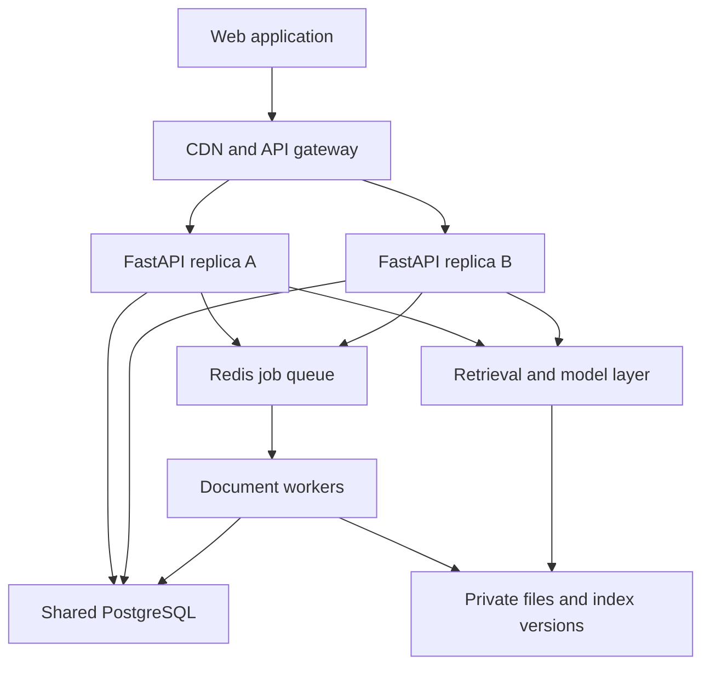

# DocMind AI — Architecture and Antigravity Build Brief

## Reference analysis and scope

The supplied image is a project concept card, not a complete application screenshot. It shows “DocMind AI — Intelligent Document Q&A & Semantic RAG Assistant”, PDF/DOCX input, embeddings, FAISS retrieval, LLM synthesis, and source citations. Its visual language is dark navy, cyan, violet, magenta, and restrained yellow accents. The hidden “+2” technologies cannot be identified from the image. “Verified Answer” is an illustration label, not evidence of guaranteed accuracy.

Build a responsive document research workspace for students and small teams. Users upload documents, ask questions, inspect supporting passages, and preserve conversations. RAG means retrieving document passages before asking the language model to compose an answer. This document is a proposed design and implementation specification; the application has not been built or benchmarked here.

Interpret “llop engineering” as an iterative agent build loop: plan → implement → check → repair → commit → push → next task. This is an explicit assumption, not a named Antigravity feature.

## 1. Product and interface design

### Visual system

- Background #0B1020; panels #151D35; elevated surfaces #1C2742; borders #34425D.
- Main text #F4F7FC; secondary text #B5C1D4; cyan #56E6E0 primary action; violet #A78BFA AI accents; amber #FBBF24 warnings; red #F87171 errors.
- Sans-serif interface, 16px body, 14px secondary labels, 24–32px headings. Use a readable local/system font fallback.
- 8px spacing scale, 12px card corners, subtle borders, modest shadows. Limit glow to decorative accents; avoid animated particles behind working content.
- 120–180ms transitions, reduced-motion support, keyboard focus indicators, 44px minimum touch targets, and verified text contrast.

### Desktop workspace

Use a 240px collapsible navigation sidebar; a flexible conversation area; and an optional 360–440px sources panel. Header contains workspace name, document scope selector, upload action, and user menu. The chat composer remains accessible at the bottom without covering content. On narrow desktop widths, the sources panel becomes a drawer.

At mobile widths, use a single chat column, drawer navigation, full-screen document/source viewer, and a composer that handles the software keyboard. No horizontal scrolling for primary controls.

### Screens and working controls

| Screen | Content | Required behavior |
|---|---|---|
| Welcome/sign-in | Value proposition, sample questions, sign-in | Demo data clearly labeled; real authentication required for private documents |
| Overview | Recent documents, recent chats, upload action | Counts come from real data; useful empty state |
| Document library | Filename, type, size, state, upload date, search/filter | Upload, rename, select, retry failed processing, delete with confirmation |
| Chat workspace | Scope chips, messages, composer, source drawer | Streaming, stop generation, follow-up questions, copy answer, feedback, retry errors |
| Source viewer | PDF page or extracted DOCX section, highlighted passage | Citation opens exact authorized document version and passage |
| Conversation history | Titles, timestamps, search | Reopen, rename, delete; refresh preserves history |
| Settings | Profile, theme, language, usage | Persist settings; show actual configured usage limits |
| Owner operations | Failed jobs, processing backlog, latency summaries | Owner authorization; retry jobs without exposing other users' documents |

MVP: PDF, DOCX and TXT; document-scoped and multi-document Q&A; citations; chat history; indexing status; retry; deletion; responsive design. Support English and Hindi answer preferences. Multilingual retrieval depends on the selected embedding model and must be evaluated.

Later phases: scanned-document OCR, collaborative workspaces, summaries, study questions, export, richer table extraction. Do not silently represent unsupported scanned files as successfully indexed. For DOCX use section/paragraph references rather than inventing page numbers.

### Dynamic states

Document states: uploaded → queued → extracting → embedding → indexing → ready; any processing stage can fail with an actionable reason. Deletion marks the document inaccessible immediately, then runs cleanup. Display indeterminate progress where real percentages are unavailable.

Chat states: empty, retrieving, generating, complete, stopped, disconnected, failed, insufficient evidence. Preserve drafts after recoverable errors. Offer “Upload a document” when none exist and disable questions when the selected scope has no ready documents. During streaming, provisional citations must be distinguished from final validated references.

## 2. Architecture

### Recommended components

| Component | Proposed choice | Purpose |
|---|---|---|
| Web | React + TypeScript + Vite; Tailwind; accessible component primitives | Responsive UI, lazy routes, reusable controls |
| Client data | TanStack Query | Request deduplication, caching, pagination, controlled retries |
| API | Python FastAPI with async I/O | Authenticated document/chat APIs and answer streaming |
| Metadata | PostgreSQL + SQLAlchemy + migrations | Users, permissions, documents, chunks, chats and jobs |
| Files | Private S3-compatible object storage | Originals and versioned index artifacts |
| Queue | Redis + Celery workers | Durable processing workflow with retries and idempotency |
| Retrieval | Dedicated CPU FAISS service for MVP | Search immutable workspace-specific indexes |
| Models | APINEX `free/glm-5.3-flash` for answers; separate embedding adapter | Grounded answers, capability-tested streaming, timeouts, token budgets |
| Edge | CDN for static files; reverse proxy/load balancer for API | Fast asset delivery and API replica routing |
| Operations | Structured logs, metrics, error tracking | Diagnose actual bottlenecks and failures |

Keep the backend a modular application initially; separate process roles for API, background jobs and retrieval. Do not create many microservices before the workload requires them.

### Request and job topology



Use one API replica and one worker for a low-cost development baseline; provide a two-API-replica configuration for load testing and growth. Extra processes on the same undersized machine do not create extra CPU or RAM. Configure database connection budgets across every replica and worker. Redis, PostgreSQL and a single retrieval instance remain shared dependencies; API replication alone is not full high availability.

### Ingestion flow

1. Authenticate membership; validate file extension, MIME/signature, configured size limit and quota. Default proposal: 20 MB per document, configurable.
2. Authorize a short-lived upload to a private object key. Validate actual uploaded bytes before processing; never trust client metadata.
3. Commit document and durable job/outbox records, return acceptance immediately, enqueue through a recoverable dispatcher.
4. Worker extracts text with page/section offsets, records extraction warnings, and chunks by headings and token limits. Start with 500–800 token chunks and 80–120 overlap, then tune through evaluation.
5. Batch embeddings with bounded concurrency and provider limits. Store embedding model, dimension, chunk version and content hash.
6. Build a new immutable FAISS index version and ID mapping; verify artifact checksum and compatibility. Publish the active version atomically after artifacts are durable.
7. Mark the document ready and expose progress through status requests or events. Repeated job delivery must not duplicate chunks or index entries.

FAISS CPU read-only searches can run concurrently, but writes require coordination. Use one index publisher per workspace and versioned snapshots. Never let API replicas mutate separate local copies of the same logical index. Readers pin a version per request; refresh only when a new manifest is complete. Large tenants should use partitions or a metadata-filtering vector-store adapter when measured needs justify migration.

### Question-to-answer flow

1. Authenticate and authorize workspace, chat and selected document IDs.
2. Persist a user message using an idempotency key; freeze selected document versions for this answer.
3. Form a retrieval query from the question and bounded conversation context; embed using the index-compatible embedding model.
4. Search only the authorized scope. MVP uses workspace indexes with membership required for all workspace documents; a selected-document subset must be filtered using allowed chunk IDs and adaptive retrieval or a scoped index. Do not take global top-k and then assume a post-filtered empty result proves no evidence exists.
5. Retrieve candidates, deduplicate overlapping passages, optionally rerank, then send the best passages within a model context budget. Begin with about 20 candidates and 6–8 final passages as tuning parameters.
6. Instruct the LLM to treat documents as untrusted evidence, never as instructions. It must cite supplied chunk identifiers and state when evidence is insufficient or contradictory.
7. Stream progress and answer deltas over an authenticated fetch-based SSE response. Validate final citation identifiers and referenced document versions server-side. Citation validation checks provenance; it does not prove every claim true.
8. Save the final answer, citations, usage and timing. On stop/disconnect, cancel upstream generation where supported and persist partial status without reporting success.

No percentage “confidence” or “verified” badge without a defined, evaluated scoring method. Use “Sources attached” with inspectable evidence.

### Selected answer model: APINEX

Use the user's selected model exactly: `free/glm-5.3-flash`. Configure the server-side adapter with base URL `https://api.apinex.bond/v1` and POST `/chat/completions`, using `Authorization: Bearer <APINEX_API_KEY>` and JSON messages. Do not silently replace it with the paid `glm-5.3-flash` identifier or another model.

Backend environment configuration:

```dotenv
LLM_PROVIDER=apinex
APINEX_BASE_URL=https://api.apinex.bond/v1
APINEX_MODEL=free/glm-5.3-flash
APINEX_API_KEY=
```

The empty key is intentional in `.env.example`. Supply the actual key through the backend's environment/secret settings; never put it in `VITE_*`, frontend code, committed files or logs. Browser requests go to the authenticated FastAPI backend; only that backend calls APINEX. Reuse an async HTTP client, configure connect/read/overall deadlines and close responses on cancellation.

The provider's chat documentation describes OpenAI-compatible JSON and SSE streaming with `stream: true`. Confirm both non-streaming and streaming on this exact free model with a synthetic test when a key is configured. Do not claim live verification from documentation alone. Parse `choices[].message.content` for ordinary responses and `choices[].delta.content` for streamed answer text, handling empty deltas, finish events and errors. Do not display or persist provider reasoning fields as the answer. If streaming is unsupported on this route, use a deliberate non-streaming fallback with a generating state; do not simulate live model tokens.

For RAG, construct messages server-side from the grounding instruction, bounded chat context, retrieved passages with stable citation IDs, and the user's question. Treat passage text as untrusted data. Continue to validate citations and source permissions independently of the model response. Do not send full documents when a small set of relevant passages is sufficient.

This chat endpoint does not establish embedding support. Keep `EmbeddingProvider` separate and configure a vetted local or hosted multilingual embedding model before ingestion is enabled. Do not call this chat model to invent embedding vectors. Indexing and querying must use the same embedding model, normalization, dimension and version; changing that model requires reindexing. Local embedding inference must be moved off the API event loop and included in memory/latency measurements.

Handle 401/403 as a server configuration/access failure; 429 as quota/rate limiting with bounded retry and Retry-After support; transient 5xx/timeouts with capped backoff before any answer tokens have been emitted. Once a partial answer is visible, preserve interrupted status rather than restarting invisibly. The free route must not be assumed unlimited or covered by a latency guarantee. API replicas share provider limits: coordinate concurrency/rate limits through shared state. No automatic paid fallback.

Required integration checks: exact model ID sent; key stays server-side; ordinary answer parsing; SSE parsing across arbitrary network chunk boundaries; cancellation; malformed/empty response; denied key; exhausted quota; transient failure; citation preservation; insufficient evidence. Use synthetic documents for the initial provider smoke test. State clearly if tests are mocked or if no key is available. Extracted passages sent for answers are processed by APINEX; make this data flow clear in the app's privacy information and confirm provider terms before using confidential documents.

APINEX documentation: https://apinex.bond/developers/models/chat
Model catalog: https://apinex.bond/
Provider capabilities are documented claims, not independently benchmarked model performance.

## 3. Data and API contracts

Tables: users; workspaces; memberships(user_id, workspace_id, role); documents(workspace_id, version, status, hash, storage_key); chunks(document_id, version, text, locator, embedding_id); index_versions(workspace_id, model, dimension, manifest, state); jobs(attempts, stage, error, idempotency_key); conversations; messages; citations(message_id, chunk_id, document_version, locator); usage_events; audit_events; outbox_events.

Every resource is workspace-scoped. MVP members can access all workspace documents; individual document ACLs require retrieval filtering changes before release. Roles: owner and member. Owner controls membership and operations. Private files are never publicly addressable by predictable IDs.

| Method and route | Contract |
|---|---|
| POST /api/v1/uploads | Validate intent; return upload ID and constrained upload URL |
| POST /api/v1/uploads/{id}/complete | Verify object, schedule processing; return 202 and job ID |
| GET /api/v1/documents | Authorized, filtered, cursor-paginated documents |
| GET /api/v1/documents/{id} | Status, version and extraction warnings |
| POST /api/v1/documents/{id}/retry | Idempotent retry of eligible failed processing |
| DELETE /api/v1/documents/{id} | Immediately revoke availability; queue durable cleanup |
| POST /api/v1/conversations | Create chat with authorized document scope |
| GET /api/v1/conversations/{id}/messages | Paginated durable history |
| POST /api/v1/conversations/{id}/messages | Idempotent generation request; streamed progress/delta/citation/done/error events |
| POST /api/v1/generations/{id}/cancel | Authorized best-effort cancellation |
| GET /api/v1/citations/{id}/source | Recheck access and return source locator/short-lived preview URL |
| GET /health/live and /health/ready | Process liveness and critical dependency readiness |

Use generated OpenAPI types, consistent error codes, request IDs, explicit retryability, timeouts and rate limits. A failed stream after HTTP headers needs an error event and durable failure state. Never replay a completed generation on reconnect; fetch saved state and let the user explicitly retry interrupted generation.

## 4. Performance and reliability plan

- Deliver compressed static assets through CDN; lazy-load PDF viewer and secondary routes. Avoid loading full document bodies on dashboard startup.
- Render first useful UI immediately; use skeletons and virtualized long message/document lists. Batch streamed token rendering to avoid a React rerender for every token.
- Parallelize independent dashboard requests and independent extraction jobs with bounded concurrency. Retrieval depends on embeddings, and answer generation depends on retrieval; preserve these dependencies.
- Keep OCR, parsing and embedding workloads outside API event loops. Bound FAISS search threads to avoid CPU oversubscription.
- Reuse outbound HTTP connections; use async database access and bounded connection pools. Avoid N+1 queries and index common workspace/status/date lookups.
- Cache safe metadata with workspace-scoped keys and invalidation. Embedding/retrieval caches include scope, document versions and model version. Avoid cross-user answer caching in MVP.
- Retry transient job/model errors with backoff, jitter, attempt caps and dead-letter handling. Do not retry validation/auth errors or automatically duplicate billable completed generations.
- Configure streaming-friendly proxy timeouts, heartbeats and graceful shutdown. Rate-limit per user/workspace and constrain maximum output tokens and simultaneous generations.
- Track p50/p95 latency, time to first answer token, retrieval time, queue age, worker utilization, errors and model usage. Exclude private document text from routine logs.

Proposed acceptance targets, not promised results: LCP <=2.5s on a specified mobile/4G test; p95 metadata API <=300ms server-side; p95 retrieval <=500ms at the documented corpus size; p95 first answer token <=3s with a selected warm provider; API errors <1% under a defined supported load. Full-answer latency varies by response length and provider. Report cold starts separately.

Benchmark baseline and two-replica configurations using the same dataset and hardware budget disclosure. Start with 20 concurrent browsing users, 5 concurrent chats and 2 ingestion jobs. Record corpus chunk count, model, hosting region, CPU/RAM and provider limits. Compare with ingestion active to verify chat isolation. Use mocks only for isolated API tests; separately report real-provider end-to-end results and cost. Scale the measured bottleneck rather than blindly adding API servers.

## 5. Security and correctness acceptance

- Use a maintained authentication solution with validated sessions/tokens; secure HttpOnly cookies and CSRF protection if cookie-based. Never put model keys in browser code.
- Enforce membership for every file, conversation, job, citation and download. Test cross-workspace ID substitution and cache isolation.
- Treat uploaded text as untrusted prompt content. No document-driven tool execution, external link fetching or secret access.
- Sandbox parsers; enforce decompression/page/time limits and reject corrupt/encrypted/unsupported files with clear messages. Sanitize rendered Markdown and source previews.
- Deletion immediately excludes content from retrieval and previews, invalidates caches, then cleans files/chunks/indexes through retryable jobs. Existing chats must not keep exposing deleted source excerpts; redact affected content according to the declared retention policy.
- Maintain a curated evaluation set with answerable, unanswerable, conflicting, Hindi/English and malicious-instruction documents. Measure evidence retrieval, citation correctness and unsupported claims. Do not claim zero hallucinations.
- E2E: sign in → upload → indexing → ask → streamed answer → click citation → reload history → delete document → confirm source and retrieval unavailable.
- Verify duplicate delivery, failed embeddings, worker restart, API replica loss, stale index version, provider timeout, and stream cancellation. Include source-support checks on representative answers, not only UI snapshots.

## 6. Antigravity execution instructions — copy with the specification above

Act as the implementation engineer for this DocMind AI specification. First inspect the workspace, existing code, repository status and project instructions. Preserve unrelated work. If this is a fresh project, scaffold it; if it is existing, adapt compatible components. Choose stable compatible dependency versions using official documentation and commit lockfiles. Never invent credentials, benchmark results or deployment status.

Implement the architecture in vertical working slices. Create docs/architecture.md, docs/tasks.md, docs/decisions.md, docs/performance.md, docs/agent-progress.md and a runnable README as part of the project. Keep the requested interface and backend behavior synchronized. Every enabled UI control must call working behavior; label unavailable later-phase features clearly.

Suggested repository modules: apps/web; services/api; services/worker; services/retrieval; packages/contracts; tests/e2e; tests/evaluation; infra; docs. Share backend domain modules where useful instead of duplicating them across services. Provide Docker development setup, migrations, example environment variables without secrets, synthetic sample documents and CI configuration.

Use this bounded loop:

1. Select the next incomplete task and record its acceptance criteria and dependencies.
2. Implement the smallest coherent functional change, including directly related files.
3. Run relevant lint/type/build checks and meaningful tests. Inspect browser behavior for UI work.
4. If a check fails, repair and retry up to three focused attempts. If still blocked, save exact evidence and the next action; do not loop indefinitely or mark the task complete.
5. Inspect the diff and staged content for accidental changes, secrets, uploaded private files and generated junk.
6. Create a descriptive conventional commit for the completed change. A single-file commit is appropriate when independently meaningful. Do not artificially split coupled files, create empty commits, backdate history or manufacture activity.
7. Push the tested commit to the user's configured feature branch when the remote and authenticated access are available and the requested push workflow is authorized. Do not guess a repository, bypass branch rules, force-push or change the configured author identity. If unavailable, retain local commits and report the missing connection once.
8. Update progress with changed files, actual checks, commit hash, push result and next task. Continue until acceptance criteria are complete or a concrete blocker prevents progress.

One agent owns git staging/commits. If parallel agents are explicitly enabled, assign disjoint modules/worktrees, agree on contracts first and serialize integration. Otherwise use a single agent with parallel independent checks and processes. Parallel servers do not require parallel coding agents.

Suggested meaningful milestones:

1. Repository setup, README, CI and design tokens.
2. Responsive application shell with empty/error states.
3. Authentication and workspace permissions.
4. Private upload and document metadata.
5. Durable ingestion jobs, progress and retry.
6. Versioned FAISS retrieval and scoped search.
7. Grounded answer generation and citation mapping.
8. Streaming chat, cancellation and durable history.
9. Source viewer and deletion lifecycle.
10. Authorization, reliability and RAG evaluation fixes.
11. Measured performance improvements and two-replica configuration.
12. Documentation, screenshots, synthetic demo and release readiness.

These are milestones, not a required commit count. Multiple genuine tasks may produce multiple commits. Prefer one tested vertical slice at a time over generating every file before anything runs.

When handing off, report implemented features, pending features, commands actually run, failures, measured results, local run instructions, deployment requirements and Git status. Do not claim live deployment until one has succeeded. Paid provisioning requires a concrete cost proposal before purchase.

## 7. GitHub contribution and portfolio notes

GitHub counts qualifying commits and other contribution events, not files or push commands. One commit with ten files remains one commit. Commit email must be linked to the intended account; GitHub's documented repository, branch and participation criteria apply. Feature-branch work generally needs to reach the default branch before appearing as commit contributions. Squash merging combines commits; use the repository's agreed merge policy rather than altering history for appearance.

There is no supported promise that a denser contribution graph increases profile views. Make the project inspectable with a working demo, clear README, screenshots, architecture, authentic development history, test results and honest performance measurements. Disclose AI assistance where appropriate and accurately describe your own role.

## Official references

- GitHub contribution criteria: https://docs.github.com/en/account-and-profile/reference/profile-contributions-reference
- FastAPI worker replication: https://fastapi.tiangolo.com/deployment/server-workers/
- FAISS concurrency guidance: https://github.com/facebookresearch/faiss/wiki/Threads-and-asynchronous-calls

Architecture and technology choices above are proposed engineering decisions. The references support the contribution and concurrency constraints; they do not guarantee the application's performance or answer accuracy.
