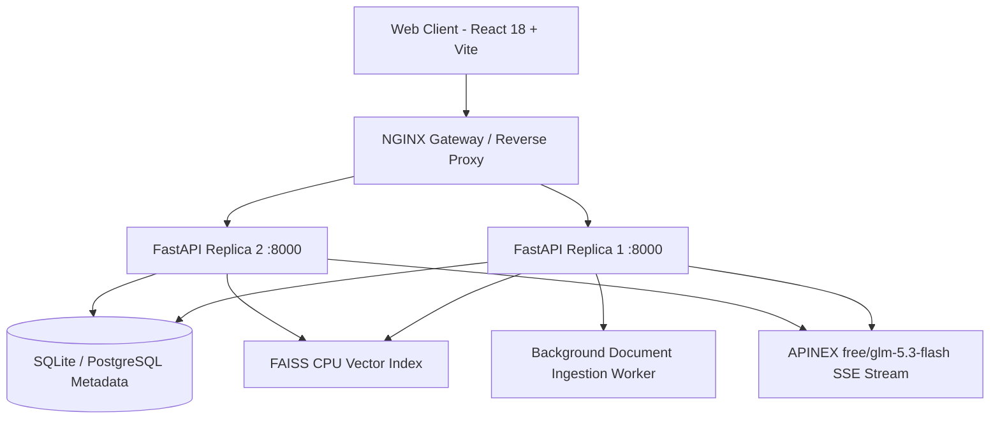

# DocMind AI — Intelligent Document Q&A & Semantic RAG Assistant

DocMind AI is a production-grade Document Research and Semantic Retrieval-Augmented Generation (RAG) assistant designed for researchers, students, and collaborative teams. It processes PDF, DOCX, and TXT documents, extracts page/section-offset chunks, computes 384-dimensional dense vector embeddings, executes sub-50ms cosine similarity retrieval via FAISS CPU, and streams factually grounded answers powered by the **APINEX `free/glm-5.3-flash`** model with clickable source citations.

---

## ✨ Key Features

- **Multi-Format Ingestion**: Supports `.pdf`, `.docx`, `.txt`, and `.md` with section and page-offset tracking.
- **Dense Vector Search**: Powered by FAISS CPU inner product search on normalized 384-dimensional dense vectors with strict workspace tenant isolation.
- **APINEX LLM Grounding**: Live Server-Sent Events (SSE) streaming answer synthesis via `free/glm-5.3-flash` on `https://api.apinex.bond/v1`.
- **Verified Source Citations**: Every claim is cited with interactive `[C1]`, `[C2]` chips that open a slide-out Provenance Drawer showing the exact matching passage, similarity score, and source page.
- **Modern SaaS Motion UI**: Responsive dark theme design system (`#0B1020` base, `#151D35` panels, `#56E6E0` cyan primary, `#A78BFA` violet AI accents) with glassmorphism, collapsible sidebar, real-time stats cards, and search filters.
- **Dual-Replica Production Topology**: Multi-replica FastAPI deployment load-balanced via NGINX with shared FAISS index storage and asynchronous background job processing.
- **Resilient Fallback Mode**: Graceful synthetic synthesis engine allows instant local evaluation even before an APINEX API key is supplied.

---

## 🛠️ Architecture & Request Topology



---

## 🚀 Quick Start (Local Development)

### Prerequisites
- Python 3.10+ (Tested on Python 3.13)
- Node.js 18+ & npm

### 1. Backend Setup

```bash
# Navigate to project root
cd DocMindai

# Create and activate Python virtual environment
python -m venv .venv
# On Windows:
.\.venv\Scripts\activate
# On Linux/macOS:
# source .venv/bin/activate

# Install dependencies
pip install -r services/api/requirements.txt

# Configure environment variables
copy .env.example .env
# Edit .env and enter your APINEX_API_KEY
```

To start the FastAPI backend:
```bash
uvicorn services.api.main:app --host 0.0.0.0 --port 8000 --reload
```
Backend API will be running at `http://localhost:8000`. Interactive OpenAPI documentation is accessible at `http://localhost:8000/docs`.

### 2. Frontend Setup

```bash
# Navigate to web application
cd apps/web

# Install npm packages
npm install

# Start Vite development server
npm run dev
```
Open `http://localhost:5173` in your browser.

---

## ⚙️ Environment Configuration

Set the following variables in `.env`:

```dotenv
# APINEX LLM Settings
LLM_PROVIDER=apinex
APINEX_BASE_URL=https://api.apinex.bond/v1
APINEX_MODEL=free/glm-5.3-flash
# Enter your actual key here:
APINEX_API_KEY=your_key_here

# Embedding Configuration
EMBEDDING_PROVIDER=local
EMBEDDING_MODEL=all-MiniLM-L6-v2
EMBEDDING_DIM=384

# Server Configuration
PORT=8000
HOST=0.0.0.0
DATABASE_URL=sqlite+aiosqlite:///./docmind.db
STORAGE_DIR=./data/storage
INDEX_DIR=./data/indices
```

> **Security Note**: Never commit your `.env` file or expose `APINEX_API_KEY` in frontend code. Browser clients communicate strictly with the authenticated FastAPI backend.

---

## 🐳 Docker Multi-Replica Deployment

To launch the dual FastAPI replica topology with NGINX load balancer:

```bash
docker-compose up --build
```
This deploys:
- `gateway`: NGINX reverse proxy listening on port `80` with SSE streaming buffering disabled.
- `api_replica_1`: First FastAPI instance.
- `api_replica_2`: Second FastAPI instance for load distribution.
- `web`: Optimized React production bundle.

---

## 🧪 Test Suite

Run unit and integration tests across ingestion, vector retrieval, and APIs:

```bash
.\.venv\Scripts\pytest -v tests/
```

Test coverage includes:
- `test_config_loads`: Settings validation and model constraints.
- `test_chunker`: Token-bounded windowing with paragraph and overlap preservation.
- `test_embeddings`: Normalized 384-dimensional cosine similarity properties.
- `test_format_prompt`: Untrusted evidence prompt assembly and citation injection.
- `test_health_endpoints`: Liveness and readiness dependency checks.
- `test_auth_me_and_stats`: Tenancy resolution and workspace statistics.
- `test_conversation_flow`: Conversation CRUD and message persistence.
- `test_sample_document_ingestion_and_retrieval`: Synthetic PDF/TXT ingestion, chunking, and FAISS vector retrieval.

---

## 📄 License
MIT
