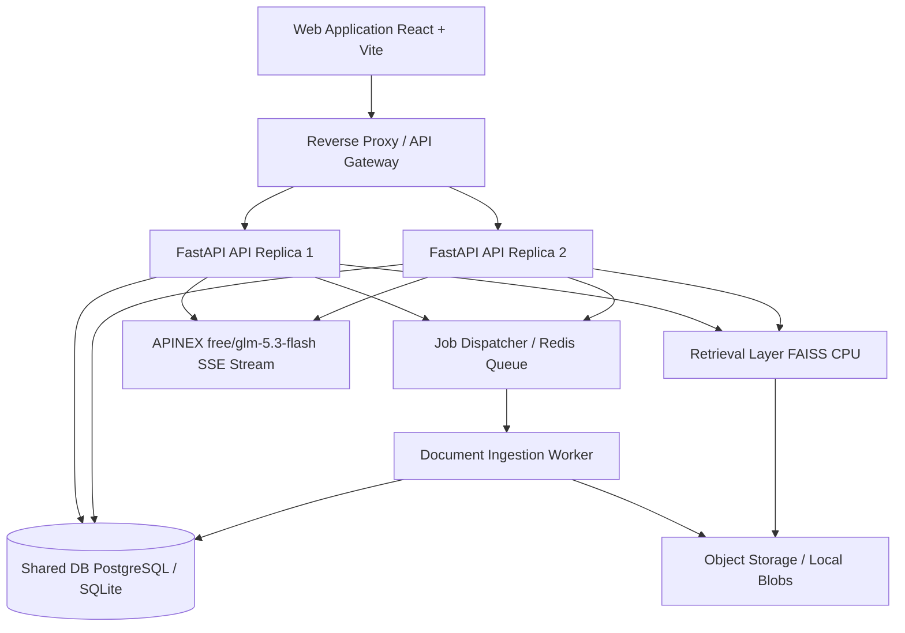

# DocMind AI — Architecture Specification

## Overview

DocMind AI is a production-grade, privacy-first Document Research & Semantic RAG Assistant designed for students, researchers, and collaborative teams. It processes PDF, DOCX, and TXT documents, extracts structured chunks, computes dense vector embeddings, stores them in immutable workspace-partitioned FAISS vector indices, and synthesizes answers using the APINEX `free/glm-5.3-flash` LLM with verified source citations.

## Request & Job Topology

## Core Subsystems

### 1. Ingestion & Document Pipeline
- **Validation**: Enforces MIME types, file signature inspection, max size limits (configurable default 20MB).
- **Extraction**: Page/section offset extraction for PDF (`pypdf`/`pdfplumber`), DOCX (`python-docx`), and plain text.
- **Chunking**: Headings-aware sliding token window (500–800 tokens, 100 token overlap).
- **Embedding**: Modular embedding adapter using HuggingFace `sentence-transformers` (`all-MiniLM-L6-v2`, 384 dimensions) running asynchronously off the event loop.
- **Vector Storage**: Workspace-scoped FAISS IndexFlatIP (cosine similarity with normalized embeddings) with immutable versioning manifests.

### 2. Retrieval & Grounded Context Assembly
- **Tenancy Isolation**: Strict workspace filtering ensures chunks from unauthorized workspaces are never queried.
- **Candidate Retrieval**: Fetches top 20 nearest chunks, applies MMR/deduplication, yields top 6–8 context passages.
- **Prompt Guardrails**: Passages injected as untrusted context with strict provenance IDs (`[doc_X_chunk_Y]`). Instructions forbid model hallucinations and state clearly when evidence is insufficient.

### 3. Synthesis & Streaming via APINEX
- **Endpoint**: `https://api.apinex.bond/v1/chat/completions`
- **Model**: `free/glm-5.3-flash`
- **Authentication**: `Authorization: Bearer APINEX_API_KEY` (strictly server-side).
- **Protocol**: Server-Sent Events (SSE) streaming token deltas (`choices[0].delta.content`) to the frontend over `/api/v1/conversations/{id}/messages`.

### 4. Interactive Frontend
- **Design System**: Rich SaaS dark aesthetic (`#0B1020` base, `#151D35` panels, `#56E6E0` cyan accents, `#A78BFA` violet AI accents).
- **Micro-Interactions**: Collapsible sidebar, animated status indicators, streaming token batching, interactive citation drawer, instant source preview.
